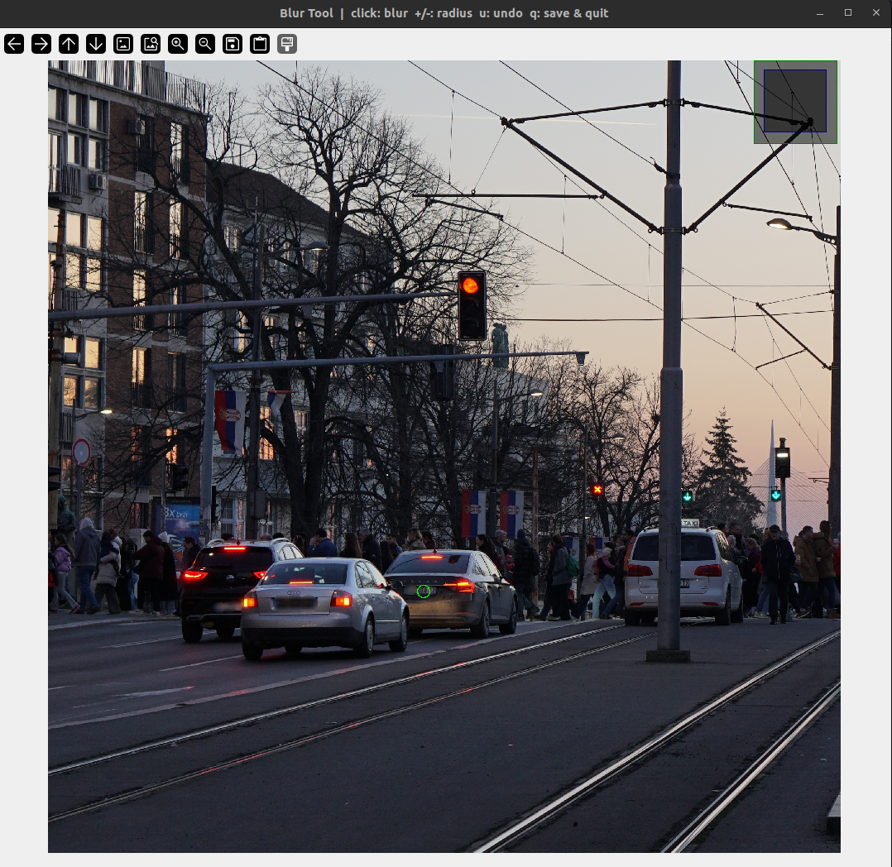

# Image Compliance Blur

A simple click-to-blur tool for anonymizing faces (or any sensitive area) in images using OpenCV.

## Features

- Click anywhere on the image to apply a circular Gaussian blur
- Adjustable blur radius and strength in real-time
- Live preview circle shows the blur area before applying
- Undo support to revert mistakes
- Saves the result alongside the original file
- Automatically scales large images to fit your screen

## Installation

```bash
pip install -r requirements.txt
```

## Usage

```bash
python blur_faces.py <path_to_image>
```

**Example:**

```bash
python blur_faces.py photos/group_photo.jpg
```

The blurred image will be saved as `photos/group_photo_blurred.jpg`.

## Example



## Controls

| Key | Action |
|---|---|
| **Left-click** | Apply blur at cursor position |
| **+** / **=** | Increase blur radius |
| **-** | Decrease blur radius |
| **]** | Increase blur strength |
| **[** | Decrease blur strength |
| **u** | Undo last blur |
| **q** | Save result and quit |
| **Esc** | Quit without saving |

## How It Works

1. The image is loaded and displayed in a resizable OpenCV window.
2. A green circle follows your cursor showing the area that will be blurred.
3. Clicking applies a circular Gaussian blur at that location. The blur is masked to a circle so it blends naturally with the surrounding image.
4. Pressing **q** saves the modified image next to the original with `_blurred` appended to the filename, then exits.